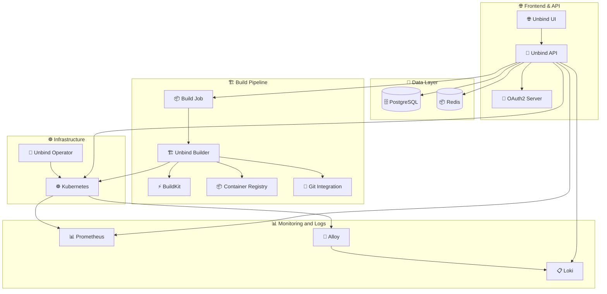

# Unbind (APIs + Builder)

<div align="center">


**Kubernetes-Based Platform as a Service**

_Effortlessly deploy, scale, and manage applications on Kubernetes_

[🚀 **Quick Start**](#-quick-start) • [📖 **Documentation**](#-api-documentation) • [🏗️ **Architecture**](#-architecture) • [🤝 **Contributing**](#-contributing)

</div>

---

## 🌟 **What is Unbind?**

Unbind is a **Platform as a Service (PaaS)** for managing all kinds of applications, it provides:

- 🎯 **Zero-configuration deployments** from Git repositories and Docker images
- ⚡ **Intelligent build system** powered by [BuildKit](https://github.com/moby/buildkit) and [Railpack](https://github.com/railwayapp/railpack)
- 🔒 **Security** integrating OAuth2/OIDC with native [Kubernetes RBAC](https://kubernetes.io/docs/reference/access-authn-authz/rbac/)
- 📊 **Metrics** with [Prometheus kube stack](https://github.com/prometheus-community/helm-charts/tree/main/charts/kube-prometheus-stack)
- 📖 **Templates** an extensible template system that supports zero-configuration deployments of many popular open-source products (plausible, supabase, wordpress, minio, and more.)
- 💾 **Production-grade Databases with Backups** with support for many popular databases through [operators](https://kubernetes.io/docs/concepts/extend-kubernetes/operator/) and helm charts - with backups to any S3-compatible storage.

---

## 🏗️ **Architecture**



### 🧩 **Core Components**

| Component           | Purpose                         | Technology          |
| ------------------- | ------------------------------- | ------------------- |
| **API Server**      | Core platform logic & REST APIs | Go + Huma Framework |
| **OAuth2 Server**   | Authentication & authorization  | Dex + OIDC          |
| **Builder Service** | Container image building        | BuildKit + Railpack |

---

## 🚀 **Quick Start**

### 📋 **Prerequisites**

- **Go 1.24+** 🐹
- **Docker & Docker Compose** 🐳
- **Kubernetes cluster** (local or cloud) ☸️
- **Dex IDP binary** in `$PATH` 🔐

### ⚡ **Local Development Setup**

```bash
# 1) Clone the repository
git clone https://github.com/unbindapp/unbind-api.git
cd unbind-api

# 2) Start infrastructure dependencies
docker-compose up -d

# 3) Start Dex Identity Provider
./startdex.sh

# 4) Configure environment variables
cp .env.example .env
# Edit .env with your settings (see config/config.go for reference)

# 5) Run database migrations
go run cmd/cli migrate

# 6) Start the services
go run cmd/api          # 🚀 API Server (port 8089)
go run cmd/oauth2server # 🔐 OAuth2 Server (port 8090)
```

### 📖 **API Documentation**

Visit **`http://localhost:8089/docs`** for interactive API documentation (OpenAPI 3.1) 📚

---

## 🔧 **Technology Stack**

### 🏗️ **Backend Technologies**

| Technology                                             | Purpose             | Why We Use It                                    |
| ------------------------------------------------------ | ------------------- | ------------------------------------------------ |
| **[Huma v2](https://huma.rocks/)**                     | REST API Framework  | Type-safe APIs with automatic OpenAPI generation |
| **[Ent](https://entgo.io/)**                           | Entity Framework    | ORM that models database entities as GO objects  |
| **[go-redis](https://github.com/redis/go-redis)**      | Redis Client        | Build queues and caching                         |
| **[BuildKit](https://github.com/moby/buildkit)**       | Container Builder   | Advanced build features and distributed caching  |
| **[Railpack](https://github.com/railwayapp/railpack)** | Application Builder | Automatically turns code into images             |

### ☸️ **Kubernetes & Cloud**

- **Cert-Manager** for TLS certificate automation with Let's Encrypt
- **Ingress NGINX Controller** for reverse proxy and load balancer
- **Prometheus** for metrics collection
- **Loki** for centralized logging
- **Alloy** for ingesting pod logs into Loki

---

## 🛠️ **Development Workflow**

### 🔄 **Code Generation**

Unbind uses extensive code generation for maintainable, type-safe code:

```bash
# Regenerate Ent entities and edges
go generate ./ent/...

# Regenerate service interfaces
go generate ./...

# Regenerate mocks for testing
mockery
```

### 🗄️ **Database Migrations**

Update entities in `./ent/schema`, then create a new versioned migration.

```bash
# Create a new migration
make migrate NAME=add_awesome_feature

# If editing the migration manually, then re-generate checksum
make migrate-checksum
```

Migrations are applied automatically on API startup.

---

## 👥 **Bootstrapping Admin User**

```bash
# Create superuser account
go run cmd/cli user:create \
  --email=admin@unbind.app \
  --password=secure_password

# Create superuser group
go run cmd/cli group:create \
  --name=superuser \
  --description="Platform Administrators"

# Add user to superuser group
go run cmd/cli group:add-user \
  --email=admin@unbind.app \
  --group-name=superuser

# Grant system-wide admin permissions
go run cmd/cli group:grant-permission \
  --group-name=superuser \
  --resource-type=system \
  --resource-id="*" \
  --action=admin

# Sync permissions to Kubernetes
go run cmd/cli sync:group-to-k8s
```

---

## 🤝 **Contributing**

We welcome contributions! Here's how to get started:

1. **🍴 Fork** the repository
2. **🌿 Create** a feature branch: `git checkout -b amazing-feature`
3. **✨ Make** your changes and add tests
4. **🧪 Run** tests: `go test ./...`
5. **📝 Commit** changes: `git commit -m 'Add amazing feature'`
6. **🚀 Push** to branch: `git push origin amazing-feature`
7. **🔄 Create** a Pull Request

---

## 📄 **License**

This project is licensed under the **MIT License** - see the [LICENSE](LICENSE) file for details.

<div align="center">

[Report Bug](https://github.com/unbindapp/unbind-api/issues) • [Request Feature](https://github.com/unbindapp/unbind-api/issues) • [Join Discord](https://discord.gg/r8Q3zNTgbp)

</div>
